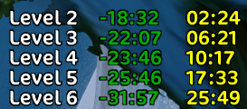
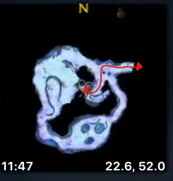

<link href="../../styles.css" rel="stylesheet" />

# Dwarf Hunter
Dwarf hunter leveling notes

This was written for Classic Era servers

## 1-6 Coldridge Valley
Summary |  |
---|---|
Time from level 1 | 30 minutes  
Splits| 

---

Task | Level | Note |
---|---|---|
Do wolf meats quest | 2 | finish right away
Pickup troggs quest | 2 | 
Buy ammo | 2 | ~3 stacks
Pickup troll killing quest | 3 |
Do boars quest in west | 3 | finish right away
Kill troggs and a few trolls to reach 4 | 4 |
Pickup timed drink quest | 4 | be able to finish troggs when back at town
Turn in quests and get serpent sting | 4 |
Pickup the eastern most tool box and kill trolls | 5 |
Turn in and pick up final troll quest | 5 | Go in cave & grind, get 850xp to lvl 6
Finish final trolls quest, turn in felix's boxes, vendor and train lvl 6 skills | 6 | 2 or 3 silver depending on if u got monkey with serpent sting
Head to exit cave and grab the quests. Kill the things. | 6 |

## 6-11 Dun Morogh
Summary |  |
---|---|
Time from level 1 | 2 hours  
Splits | 

---

Task | Level | Note |
---|---|---|
Grind boars moving to Kharanos | 6 | Get 6x rib and 6x meat
Set Hearthstone Kharanos | 6 |
Pickup quests, turn in boar ribs + malt, turn in bear pelts + boar meat | 7 | Reach level 7 close to Kharanos
Pickup more quests again | 7 | lvl 7 unlocks

You should complete Stocking Jetsteam to unlock a high value chain in Brewnall Village 

Task | Level | Note |
---|---|---|
Pickup the ammo crate, do wendigo cave grind | 7 |
Turn in ammo crate | 8 ? 7 | Buy next gun for 4s 35c. Buy ammo up to 1200
Do troll cave quest in the west | 8 | Can be risky, pull 1 at a time and min max

Follow below path for easy explored trigger

Task | Level | Note |
---|---|---|
Pickup quests in Brewnall Village | 8 |
Grind gnomes and animals to complete quests | 9 | Hold out on 2ish bears and boars
Grind Shimmerweed from trolls | 9 | Finish the bear and boar kills near the ramp up
Grind k xp into level 9 | 9 | turn ins = k xp
