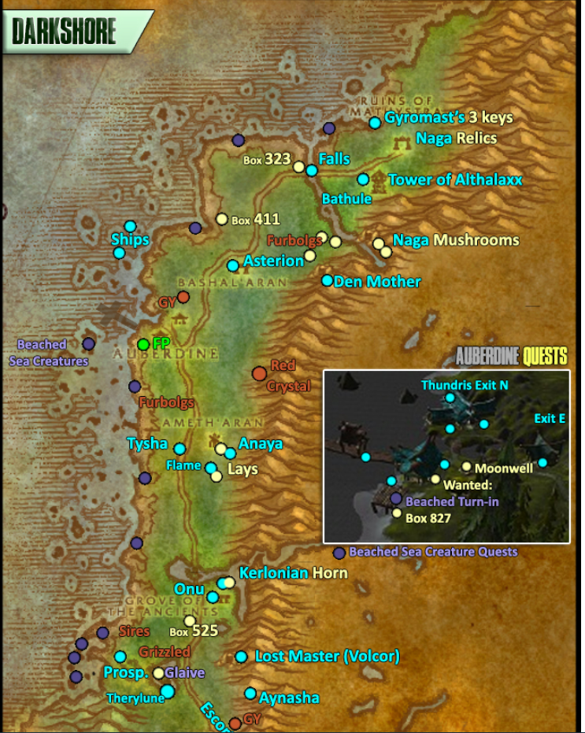

Dwarf hunter leveling notes for classic era

---

**Keep cooking mats, train during boat**

## Coldridge valley 1-5
 - wolves 8/8
 - trolls 14/14 & named mob - pickup scalding morningbrew
 - complete rockjaw troggs 6/6
 - turn ins & grab lvl 4 skills
 - boars 12/12
 - turn ins - troggs - and leave

---

## Dun Morogh 5-9
 - buy low lvl gun
 - hit lvl6 at kharanos ***goal: 25-30min***
 - grab arcane shot + **set HS** + quests
 - bear pelts + boar chunks asap
 - ammo crate
 - wendigo pelts
 - turn in crate + next gun
 - juke lvl 12 elite
 - get beast killing quest
 - kill beasts to shimmerweed
 - progress quests at kharanos, hit 8 & train
 - finish beast kills, turn ins
 - frostmane hold -> **HS**
 - turn in quests & go Vagash

---

## Loch - Dun Morogh - IF 9-10
 - run Loch, North Tunnel -> South tunnel -> Thelsamar - turn in - **set HS** - grab quests
 - FP IF -> grind to hit 10 at Kharanos *if required* -> pet tamings - take **Snow Tracker Wolf** and learn bite R1
 - go IF - quests - buy lvl 9 gun **13s25c** -> tram -> SW - quests - grab FP -> Elwynn

---

 ## Elwynn Forest - Redridge - Westfall 10-14
 - go Goldshire - pickups - **train cooking**
 - fargodeep mine and goldtooth chain - **Tame bear**
 - Goldshire - progress quests
 - murlocs + jasperlode mine -> bridge guard quests + eastvale quests
 - progress death guard quest -> red bandanas from caster island (*pick up logs, kill wolves&bears*)
 - death guard at murlocs
 - finish log pickups + wolves & bears
 - eastvale turn ins -> bridge turn ins
 - Princess Must Die
 - Redridge - FP - pickups - necklace from water -> guard quest -> run Darkshire
 - Darkshire - FP -> SW - **train 12** -> Hogger Wanted Sign
 > **train 12:** Wing Clip, Arcane Shot r2, Mend Pet, Distracting Shot, Pet sta/arm

> **HS Idea; set SW or Goldshire?** Need to crunch the numbers  
> flying SW->Thelsamar is 317s.  
> Darkshire->SW is 88s,  Sentinel hill->SW is 86s, SW->Goldshire run is ?s

 - Hogger -> Sentinel Hill
 - westfall entry - gnoll paws + bandanas + defias p1
 - turn ins - run goldshire - turn ins -> **HS Thelasamar**

---

## Loch Modan -> wetlands skip 14
 - run north - turn in - wetlands skip

---

## Darkshore 14-15
 - pickups + FP - boat to Darn - learn Staves
 - staff quest (red crystal) + Planestrider cooking Q (Partial)
 - crabs buzzbox 827 + washed ashore + How Big a Threat p1 - turn in
 - threshers buzzbox 411 + washed ashore p2

*map credits: [Alenya and Umbra's Alliance Leveling Maps](https://www.patreon.com/posts/full-1-60-guide-25730114)*  

 ### North p1 15-16
 - turn in 'specific quests' **TBD** at auberdine - Thundris Exit North
 - ships quest -> nearby Beached Sea Creature -> finish Buzzbox 411 (start 323)
 - Bashal'Aran quests
 - Beached Sea Creature straight up north -> River water -> Beached Sea Creature
 - Moonstalker Fangs -> A Lost Master The Tower of Althalaxx -> Cave Mushrooms
 - back to Auberdine pickup **Rabid Thistle Bear for Plagued Lands**
 - Darnassus to **train 16**
> **train 16:** Immolation Trap, Raptor r3, Scare Beast, Eagle Eye, Eyes of the Beast
 
 ### South p1 16-17
 - turn in 'specific quests' **TBD**
 - How Big a Threat (furbolgs) p2
 - Ameth'Aran quests
 - pickup 2 Beached Sea Creatures along coast + kill rabid thistle bears ***partial***
 - Fruit of the Sea (*partial pending rng*) + Murkdeep
 - Buzzbox 525 (Grizzled bears) + A Lost Master p1 (5 pelts) ***partial*** -> Onu
 - bears & cats & crabs ***partials*** -> Finish up Beached Sea Creatures
 - Glaive & Therylune's Escape escort
 - Finish Fruit of the Sea(crabs) + A Lost Master (pelts) + Buzzbox 525 (turn in)
 - One Shot. One Kill. if up
 - The Sleeper Has Awakened escort quest
 - Tower of Althalaxx gem grind
 - go Astranaar FP->Auberdine

### North p2 17-18
 - turn in 'specific quests' **TBD** *everything & HS?*
 - exit Auberdine East -> Bashal'Aran turn in
 - Furbolgs finisher + Den Mother -> Naga Relics + Gyromast's keys
 - Finish up Gyromast questline
 - back to Auberdine for turn ins ***or HS***